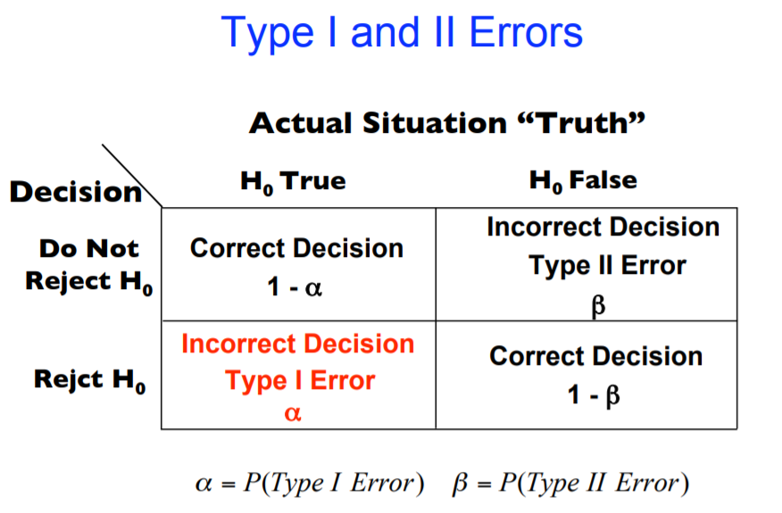
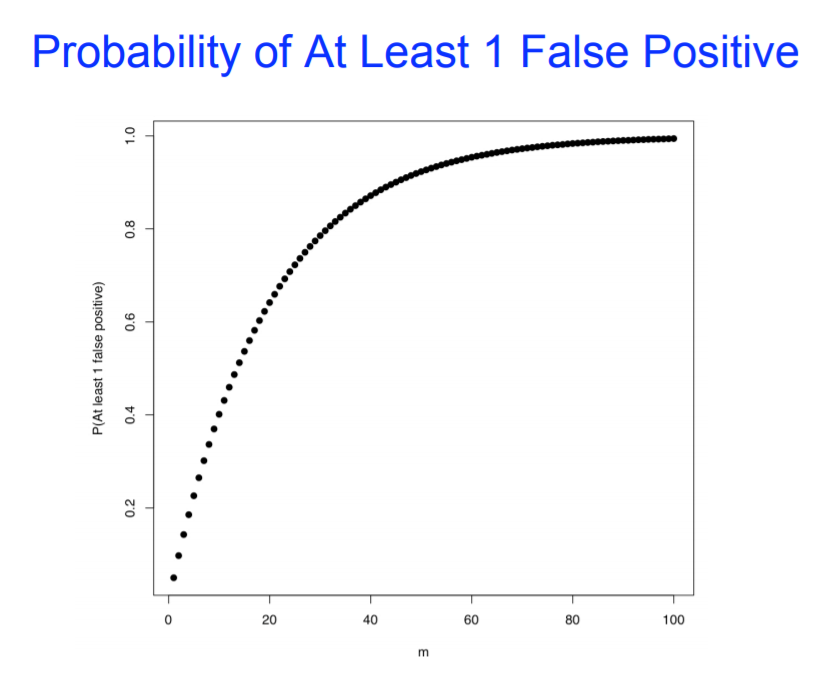

# 多重假设检验校正与P-value
> originally from 生信宝典  
> only for self study

## 单次检验的I类错误

假设检验是用于检验统计假设的一种方法，其基本思想是“小概率事件”原理，即小概率事件在一次试验中基本上不会发生。

假设检验的基本方法是提出一个空假设（null hypothesis），也叫做原假设或无效假设，符号是`H0`。一次检验有四种可能的结果，用下面的表格表示：

* Type I error，I类错误，也叫做α错误，假阳性。
* Type II error，II类错误，也叫做β错误，假阴性。

## 多次检验使得犯I类错误概率增大

在传统的假设检验中，单个检验的显著性水平或I型错误率（错误拒绝原假设的概率）为计算出的P-value。但随着检验次数的增加，错误拒绝原假设的概率即I型错误率大大增加。

例如：如果我们进行了m次假设检验，至少有1个假阳性的概率是多少？

> 错误拒绝原假设的概率 P(Reject H0|H0=True) = α  
> 决策正确的概率 P(No Reject H0|H0=True) = 1-α  
> P(在m次检验全部决策正确)=(1-α)^m  
> P(在m次检验中至少一次决策错误) = 1-(1-α)^m

随着检验次数的增多，出现至少一次决策错误的概率快速提高。当说起“根据假设检验的次数校正p值”时，意思是控制整体的I型错误率。

例如：当做差异基因检测时，每个基因分别进行检测生成一个p值。如果p值设置为0.05，每个差异基因识别出错的概率为5%。如果同时分析100个基因，按照p<0.05筛选的差异基因中有5个可能是差异不显著的。如果对一组10000个基因进行检测，按照p<0.05筛选的差异基因中有500个可能是差异不显著的。因此，同时进行多次统计检验时，校正每个基因的p值是很重要的。多重检验校正调整每个基因的p值，以使总体错误率小于或等于用户指定的p-cutoff value。

## 如何进行多重假设检验校正？

### Family Wise Error Rate校正法控制假阳性率为0

Family Wise Error Rate是控制全部比较中至少出现一次Type I error的概率，也就是控制假阳性率为0。这是很严格的方式，通常有两种计算方法：

#### Bonferroni correction方法

如果要维持整个检测 (做了m次检测)的Type I error rate < 0.05，则需要设定p-value为0.05/m作为筛选标准。反过来，如果我们做了10000次统计检测，采用Bonferroni correction方法校正后的p值就是原始`P-value * 10000`。

这对其中任何一个检测是否差异统计显著是不公平的，因为它取决于检测的总数目。一个检测放在有100次检测的操作集合中可能统计显著，而放在有1000次检测的操作集合中可能统计就不显著了，这是不合适的。

#### Holm 校正方法

Holm 校正方法相对没有那么严苛。假设针对10000个基因进行了统计检验，对所有的原始P-value进行**由小到大**的排序分别为`p1, p2, ..., p10000`，校正后的p为：`p1*10000, p2*9999, ..., p10000*1`。

### FDR校正法：允许一定的假阳性率

在实际应用中，我们希望减少Type I Error出现的可能，但也可以容许一定的假阳性率的存在。

Benjamini and Hochberg FDR (BH)是我们最常用的校正P-value控制假阳性率的方式。假设针对10000个基因进行了统计检验，对所有的原始P-value进行**由小到大**的排序分别为`p1, p2, ..., p10000`，校正后的FDR为：`p1*10000/1, p2*10000/2, ..., p10000*10000/10000`。与Bonferroni correction一致的地方是都乘以了检测总数，不一致的地方是BH算法在此基础上除去了各个原始p-value的排序值。

BH法有时也称FDR法，是我们最常用的多重假设检验校正方法，可以很好的控制假阳性率和维持统计检出力。R函数p.adjust可用来计算一组p-value校正后的FDR值。(DESeq2中返回的padj也是用BH方法控制的FDR)

## 是否需要p值校正？

* 如果多次假设检验的结果之间有影响，或需要将多次假设检验的结果合并分析，则需要校正。例：寻找两种条件下具有差异表达的基因，我们会对每个基因在两组样本里的表达量分别进行检验（多重假设检验），但最后获得所有差异表达基因时需要将上述各结果合并，若不进行校正，则差异表达基因中假阳性结果就较多，故需要校正。
* 反之，如果多次假设检验的结果仅用来单独分析，不会将结果合并，则无需校正。例：将基因分成几个基因集，比较这几个基因集之间某特征是否有显著差异，因两两之间的比较与其他基因集并无关联，故不需要校正。

## q-value是什么？

q-value是Storey和Tibshirani提出的基于p-value分布的FDR计量方法，详见[此推文](https://mp.weixin.qq.com/s?__biz=MzI5MTcwNjA4NQ==&mid=2247488229&idx=1&sn=2c4f1fbba7f4af9797ffd6ff06a200c5&scene=21#wechat_redirect)。

## 如何尽量减少统计检验次数

我们看到上面的校正方法多于统计检测次数有关，统计检测次数越多，校正也会越强烈。有没有合适的办法来规避一些无意义的统计检验呢？

* WGCNA方法通过把基因聚类为模块再进行统计分析，大大降低了统计检验次数
* GSEA、GO等富集分析时合并相似的GO/KEGG通路再进行富集分析
* 差异基因分析时过滤掉极低表达的基因 (低表达基因通常生物意义小或检测噪声大，即便有差异也难分清是生物差异还是技术差异)

## 如何获得更小更稳定的检测P-value

* 增加生物重复使得统计结果检验更稳定
* 选择合适的统计方法屏蔽个体差异，详见公众号**生信宝典**推文[批次校正](https://mp.weixin.qq.com/s?__biz=MzI5MTcwNjA4NQ==&mid=2247495952&idx=1&sn=fd7f0472fb97a7da9199ffde0e17c07d&chksm=ec0e349adb79bd8c9961fe445b0f3cd6ef3a583f98a510a02aea18ff3be9710395961a92168f&token=342863021&lang=zh_CN&scene=21#wechat_redirect)和[limma配对检验](https://mp.weixin.qq.com/s?__biz=MzI5MTcwNjA4NQ==&mid=2247488116&idx=1&sn=62c480f623f37f2fc16d78a0be62685b&scene=21#wechat_redirect)。

